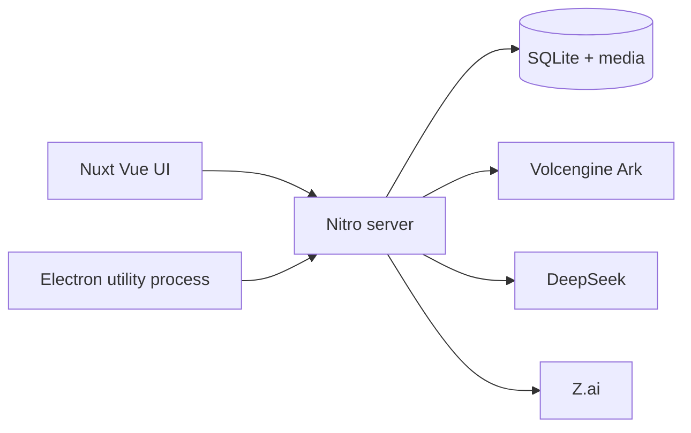

<p align="center">
  
</p>

<h1 align="center">Miao AI</h1>

<p align="center">
  China-native multimodal AI agent.<br>
  Chat, generate, and edit with GLM, DeepSeek, Doubao, Seedream, and Seedance — on an infinite canvas.
</p>

<p align="center">
  <a href="LICENSE"></a>
  <a href="https://github.com/susirial/Miao-AI/actions/workflows/ci.yml"></a>
  
  
  <a href="https://github.com/susirial/Miao-AI/stargazers"></a>
</p>

<p align="center">
  <strong>English</strong> · <a href="README.zh-CN.md">简体中文</a>
</p>

<p align="center">
  
</p>

Miao is a local-first, **agent-native** creative workspace: every interaction lives in a conversation, and every result lands on an infinite canvas. It is a China-native fork of [PoloX AI](https://github.com/saihhold-zhao/polox_ai), rebuilt for official mainland-China model APIs instead of WaveSpeed.

Bring your own keys. There is no Miao account or cloud workspace. Projects, chats, generation history, and media stay on your machine.

## Why Miao

- **Agent + canvas, not a prompt box.** Plan a brief, confirm models, generate stills or clips, and keep iterating in one thread.
- **China-native models.** GLM 5.3, DeepSeek, Doubao Seed text, Seedream 5.0 Pro, and Seedance 2.0. More providers are being added.
- **Web and macOS desktop.** Same Nuxt app in the browser or in an Electron shell that binds only to `127.0.0.1`.
- **Local SQLite.** API keys never leave the machine except when sent to the providers you configured.

## Screenshots

<p align="center">
  
</p>
<p align="center">
  
</p>
<p align="center">
  
</p>
<p align="center">
  
</p>

## Models

Type `@` in the agent composer to pin a model. Image and video generation go through [Volcengine Ark](https://console.volcengine.com/ark). Catalogs live in `shared/constants/modelCatalog.ts` and `shared/constants/aiModels.ts`.

| Role | Model | Provider |
| --- | --- | --- |
| Agent text (default) | Seed 2.1 Pro | Volcengine Ark · Doubao |
| Agent text | Seed 2.1 Turbo | Volcengine Ark · Doubao |
| Agent text | DeepSeek V4.1 Flash | DeepSeek official |
| Agent text | GLM 5.3 | Z.ai official |
| Image · t2i / i2i / r2i | Seedream 5.0 Pro | Volcengine Ark |
| Video · t2v / i2v / r2v | Seedance 2.0 | Volcengine Ark |

Models are still being added. Open an [issue](https://github.com/susirial/Miao-AI/issues) if you need a specific mainland-China endpoint.

## Quick start

You need **Node.js 22.20+** and **pnpm**.

```sh
git clone https://github.com/susirial/Miao-AI.git
cd Miao-AI
pnpm i
pnpm dev
```

Open [http://localhost:3001](http://localhost:3001). Keep the terminal running. You do not need `pnpm build` for everyday local use.

### macOS desktop

```sh
pnpm desktop:dev          # Nuxt HMR + Electron window
pnpm desktop:dir          # unpacked Miao.app for local checks
pnpm desktop:build        # DMG + ZIP under release/
```

Desktop data lives in `~/Library/Application Support/Miao/data`. Logs are in `~/Library/Logs/Miao`. Unsigned local builds work on your Mac; distributing to other machines needs a Developer ID certificate. Set `APPLE_ID`, `APPLE_APP_SPECIFIC_PASSWORD`, and `APPLE_TEAM_ID` to notarize.

Linux and Windows can run the **web** app today. Packaged desktop builds are macOS-only for now.

### FFmpeg (long-form video only)

Uploads and single-shot generation do not need FFmpeg. Concatenating clips into a longer video does.

```sh
# macOS
brew install ffmpeg

# Ubuntu / Debian
sudo apt update && sudo apt install ffmpeg
```

Confirm both `ffmpeg` and `ffprobe` are on `PATH`, then restart the app.

## Connect providers

1. Start Miao and open **Service connection** in the top-right corner.
2. Enter a [Volcengine Ark API key](https://console.volcengine.com/ark/region:ark+cn-beijing/apiKey). Ark powers Seed text, Seedream, and Seedance.
3. Optionally add [DeepSeek](https://platform.deepseek.com/api_keys) or [Z.ai](https://z.ai/manage-apikey/apikey-list) keys and select that text model.
4. Click **Save and test configured providers**.

The default agent model is **Seed 2.1 Pro** (`ark/seed-2.1-pro`). Connection tests send a short request and may incur a small API charge. Keys are stored in local SQLite, not in `.env`.

### Optional TOS for Seedance local references

Text-to-video and image-to-video do not need TOS. Only local video/audio used as a Seedance reference must be uploaded to a `cn-beijing` bucket. Region and endpoint are fixed to `https://tos-cn-beijing.volces.com`. Miao uploads content-addressed objects and issues short-lived GET URLs; it does not delete those objects when a task is removed.

## Architecture



- `app/` — Vue pages, canvas, agent chat
- `server/` — APIs, in-process agent loop, Ark / DeepSeek / Z.ai adapters
- `shared/` — model catalogs and types
- `electron/` — macOS shell: isolated Nitro on a random loopback port, per-launch token, no Node in the renderer

There is no hosted demo. The workspace routes are unauthenticated by design — run the web server only on your machine or a private network.

## Compared with PoloX AI

| | Miao AI | PoloX AI |
| --- | --- | --- |
| Inference | Volcengine Ark, DeepSeek, Z.ai | WaveSpeed |
| Image / video | Seedream 5 · Seedance 2 | WaveSpeed catalog |
| Desktop | macOS Electron | Web |
| Data | Local SQLite | Local SQLite |

Miao keeps PoloX’s agent-native canvas workflow and [DeepSeek Harness](https://github.com/deepseek-ai/deepseek-harness) foundation. Changes that belong in PoloX itself should go [upstream](https://github.com/saihhold-zhao/polox_ai).

## Creative workflows

Ask the agent to edit an image or video, or to produce a multi-shot piece. A typical long-form video pass:

1. Plan the storyboard from your brief.
2. Establish character references (or upload your own).
3. Generate first frames for each shot.
4. Turn shots into clips with Seedance.
5. Stitch clips with FFmpeg, then keep revising in the same conversation.

The skill file is [`server/agent/skills/long-form-video.md`](server/agent/skills/long-form-video.md).

## Local data

| Launch | Database and media |
| --- | --- |
| Web | `.data/miao.sqlite` and `.data/media` |
| Desktop | `~/Library/Application Support/Miao/data` |
| Override | `MIAO_DATA_DIR` |

Existing `.data/polox.sqlite` is copied on first launch after an upgrade. Stop the server before backing up `.data`. Treat backups as secret — they contain API keys.

See [`.env.example`](.env.example) for optional process environment. Do not put provider keys there.

## Contributing

See [CONTRIBUTING.md](CONTRIBUTING.md) / [简体中文](CONTRIBUTING.zh-CN.md). Please read [SECURITY.md](SECURITY.md) before filing anything that involves keys or local data.

```sh
pnpm lint
pnpm typecheck
pnpm test:sqlite
pnpm test:electron-main
```

## Open-source foundations

| Role | Project |
| --- | --- |
| Application | [Nuxt](https://github.com/nuxt/nuxt) |
| UI | [shadcn/ui](https://github.com/shadcn-ui/ui) Vue ecosystem |
| UI template | [nuxt-shadcn-dashboard](https://github.com/dianprata/nuxt-shadcn-dashboard) |
| Agent harness | [DeepSeek Harness](https://github.com/deepseek-ai/deepseek-harness) |
| Upstream product | [PoloX AI](https://github.com/saihhold-zhao/polox_ai) |

## License

[MIT](LICENSE). Third-party notices are listed in [NOTICE](NOTICE).
