<p align="center">
  
</p>

<h1 align="center">Miao AI</h1>

<p align="center">
  <strong>M</strong>odels · <strong>I</strong>ntelligence · <strong>A</strong>ssistant · <strong>O</strong>pen<br>
  An open creative assistant for Chinese foundation models — text, image, and video — on an infinite canvas.
</p>

<p align="center">
  <a href="LICENSE"></a>
  <a href="https://github.com/susirial/Miao-AI/actions/workflows/ci.yml"></a>
  
  
  <a href="https://github.com/susirial/Miao-AI/stargazers"></a>
</p>

<p align="center">
  <strong>English</strong> · <a href="README.zh-CN.md">简体中文</a>
</p>

<p align="center">
  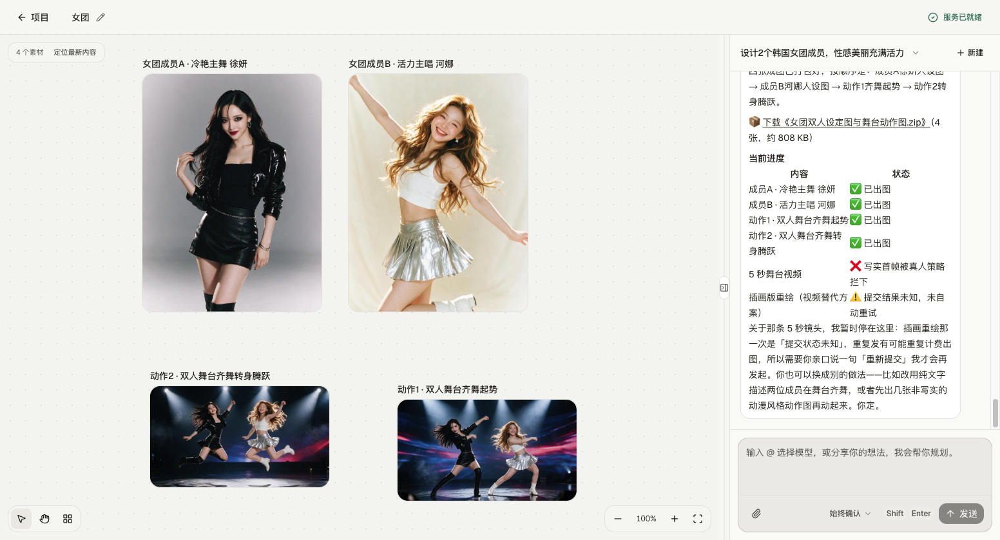
</p>

**Miao** (喵 AI) is a local-first creative assistant: you talk to an agent, and every still or clip lands on an infinite canvas. It is a modified build of [PoloX AI](https://github.com/saihhold-zhao/polox_ai).

Bring your own keys. There is no Miao account or cloud workspace. Projects, chats, generation history, and media stay on your machine.

## What MIAO means

| | Meaning | In the product |
| --- | --- | --- |
| **M** | Models | Text, image, and video models — Agnes, GLM, DeepSeek, Doubao, Seedream, Seedance, and more to come |
| **I** | Intelligence | An agent that plans, confirms choices, and runs multi-step production |
| **A** | Assistant | A creative partner on a canvas, not a prompt box |
| **O** | Open | MIT licensed, local-first, bring your own keys |

## Why Miao

- **Models, in one thread.** Pin Agnes 2.5 Flash, GLM 5.3, DeepSeek, Doubao Seed, Seedream 5, or Seedance 2 with `@` without leaving the conversation.
- **Intelligence that produces.** The agent turns a brief into stills, clips, and storyboards, then keeps iterating with you.
- **A creative assistant, not a chatbot.** Every result stays on the canvas so you can compare, reuse, and export.
- **Open by default.** Web and macOS desktop; SQLite on your machine; no Miao cloud.

## What's new

### 19 September 2026 — Agnes models and media families

Service connection now has three independent picks: text, image, and video. Home cards open the matching generator model; an explicit `@` or deep-link choice is not overwritten by the saved family. One [Agnes](https://platform.agnes-ai.com/) key unlocks Agnes text, image, and video.

- **Text:** [Agnes 2.5 Flash](https://wiki.agnes-ai.com/en/docs/agnes-25-flash.md) and [Agnes 3.0 Flash](https://agnes-ai.com/zh-Hans/docs/agnes-30-flash). Chat Vision accepts public HTTP(S) image URLs only.
- **Image:** Agnes Image 2.5 Flash alongside Seedream 5.0 Pro. Text-to-image, image-to-image, and reference-to-image; pick a 1K–4K size tier and ratio. Local JPEG, PNG, and WEBP files are sent as Data URIs.
- **Video:** Agnes Video 2.5 Flash alongside Seedance 2.0. Output is 720P for 4–12 seconds. Image-to-video and reference-to-video take public HTTPS image or audio URLs only (up to 5 reference stills). Local uploads and reference videos are not supported.

The agent shows a confirmation card before it generates. Annotated image edit no longer sends remapped TOS stills as vision URLs; Agnes Image inlines reachable HTTP(S) stills as data URIs instead.

Save-and-test now says so when no API key is configured, instead of looking like the button did nothing. Failed model requests log the host and error cause without writing keys.

When several model stills finish in parallel, the agent writes every tool result before inspecting them, so the next turn is not blocked.

You can delete a conversation from the title menu. The chat text is removed; images, videos, and uploads already on the project's canvas stay.

#### Text to image · Agnes Image 2.5 Flash

Describe the frame in natural language. The confirmation card lists the selected model and prompt, as in this Michael Jordan slam-dunk text-to-image job.

<p align="center">
  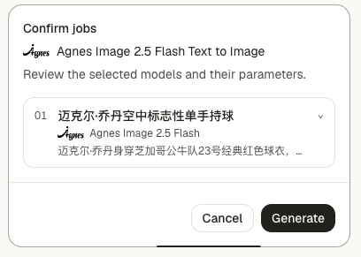
</p>

#### Multi-image reference to video · Agnes Video 2.5 Flash

Pass several public HTTPS stills into reference-to-video. The card shows 720P, duration, aspect ratio, and the reference list — here two Jordan photos for a 5-second 16:9 clip.

<p align="center">
  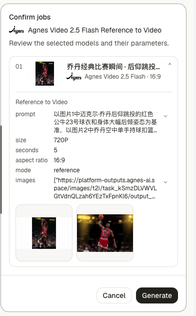
</p>

### 16 September 2026 — Guided skills

Three production workflows now start from the **Projects** page. Click a skill (or type `/` in the agent composer) and Miao walks the edit with you in the current project.

#### Annotated image edit · `/image-annotation-edit`

Drop numbered pins on the exact pixels that should change, write one instruction per pin, and keep everything else. Marker colors distinguish points in the editor.

<p align="center">
  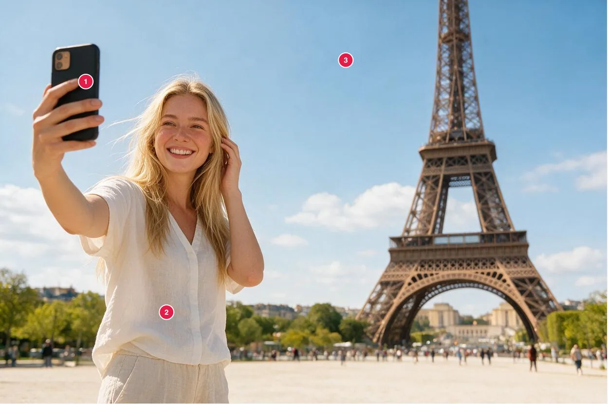
  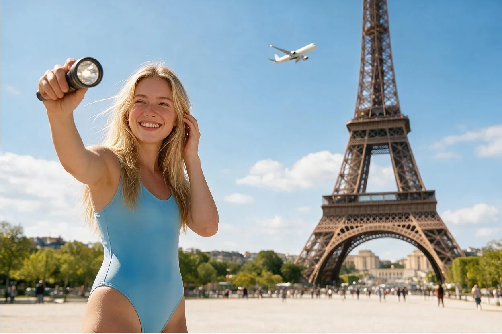
</p>
<p align="center">
  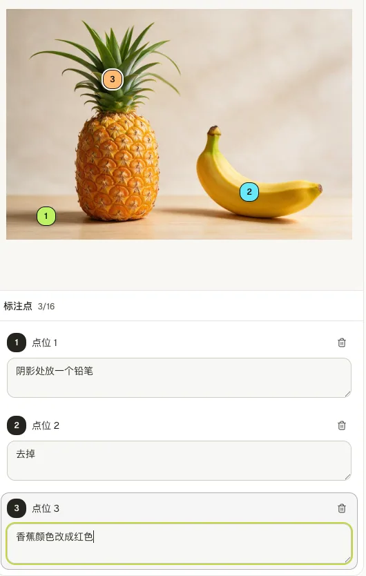
</p>

#### Sketch to image · `/sketch-to-image`

Draw a rough composition on the inline canvas. After you confirm the agent's reading of the sketch, Seedream turns it into a finished still.

<p align="center">
  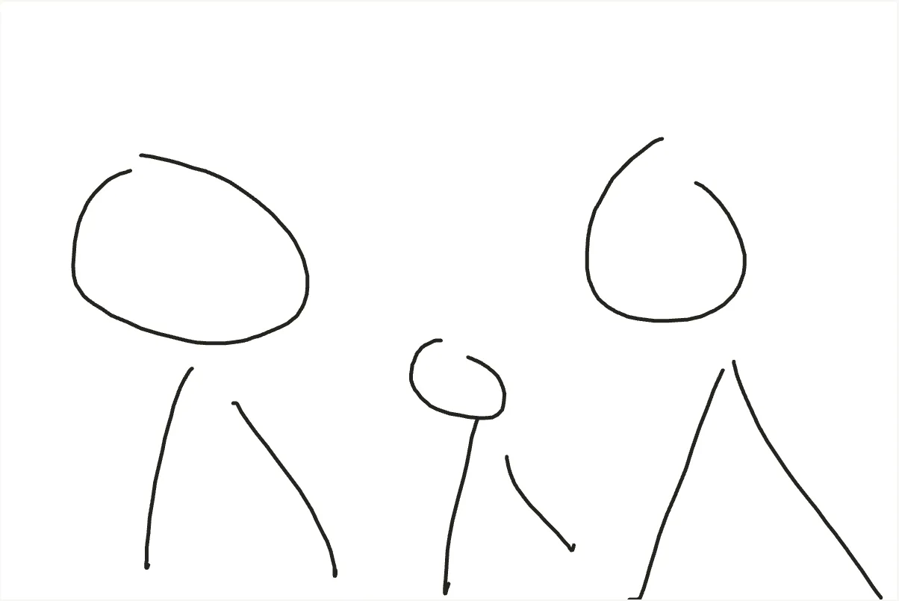
  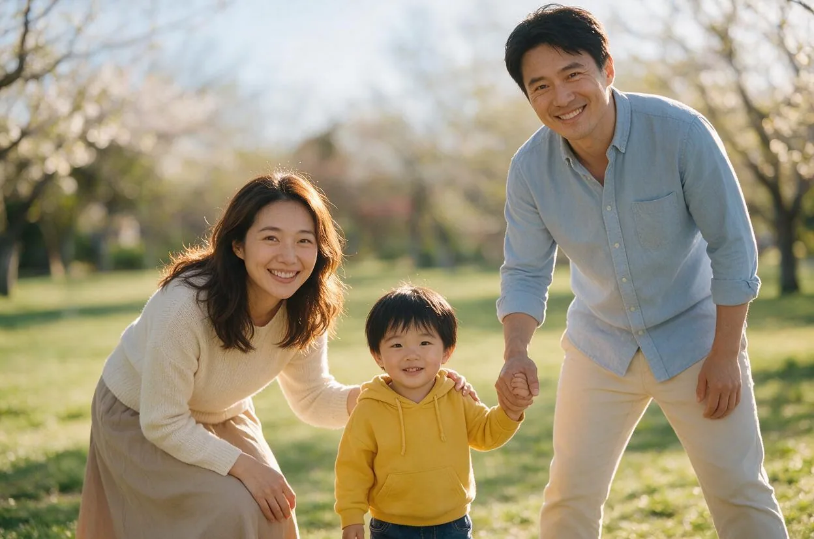
</p>

#### Marketing graphics · `/app-store-graphics`

Start from real product or app screenshots. The agent proposes a 9:16 design board (palette, type, phone framing) for you to confirm, then produces the final creatives.

<p align="center">
  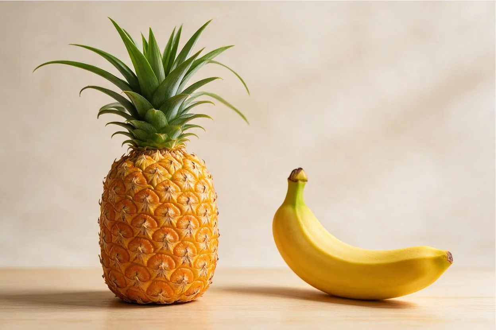
  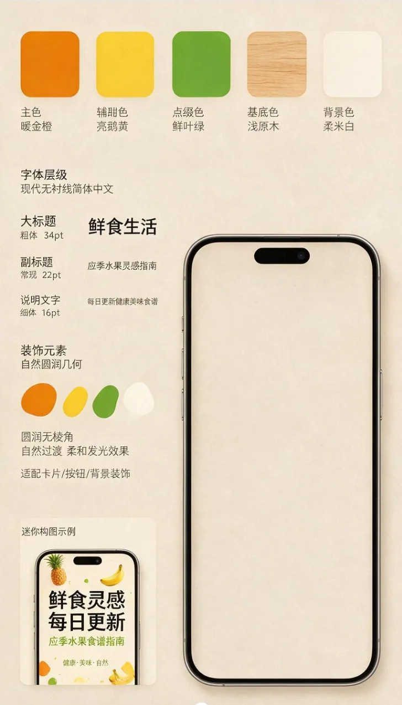
  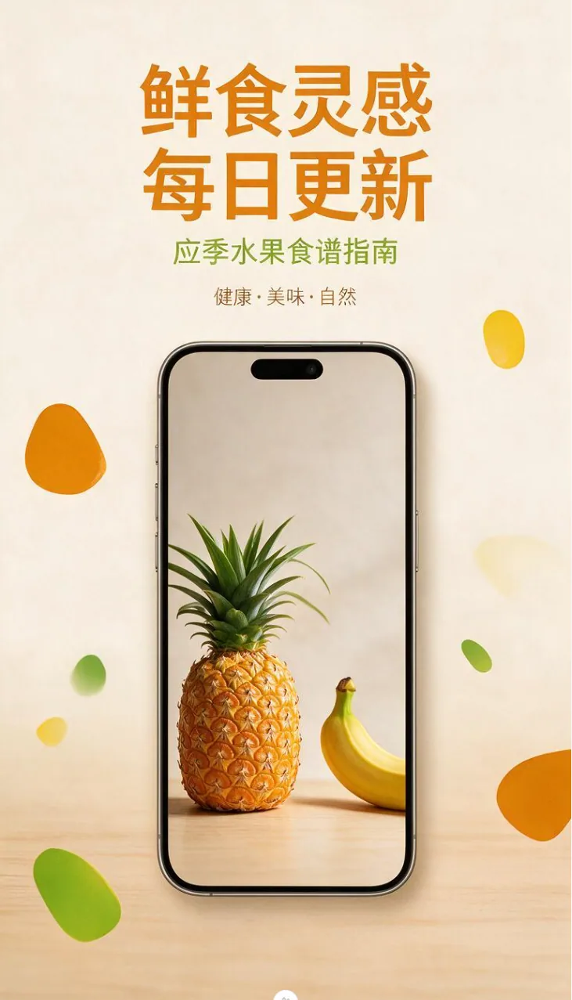
</p>

Long-form video (`/long-form-video`) remains available for multi-shot films.

## Screenshots

<p align="center">
  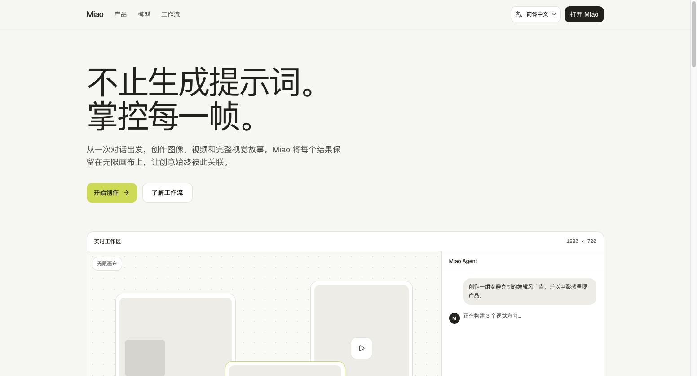
</p>
<p align="center">
  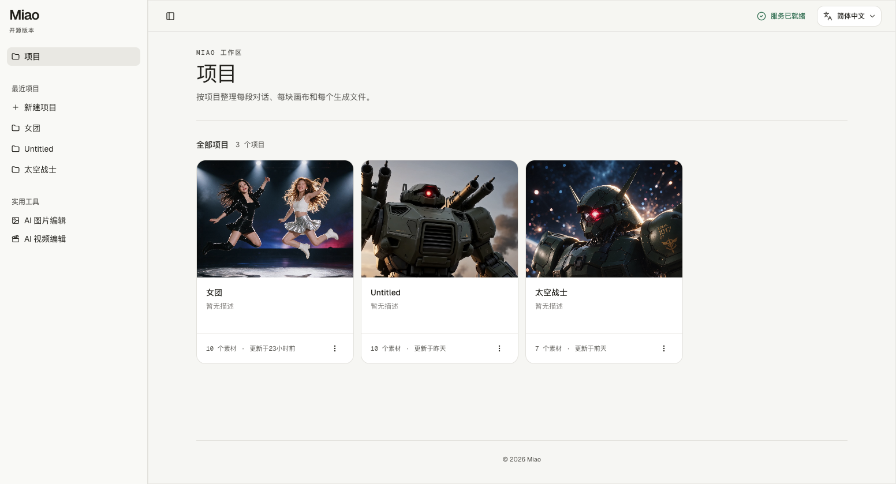
</p>
<p align="center">
  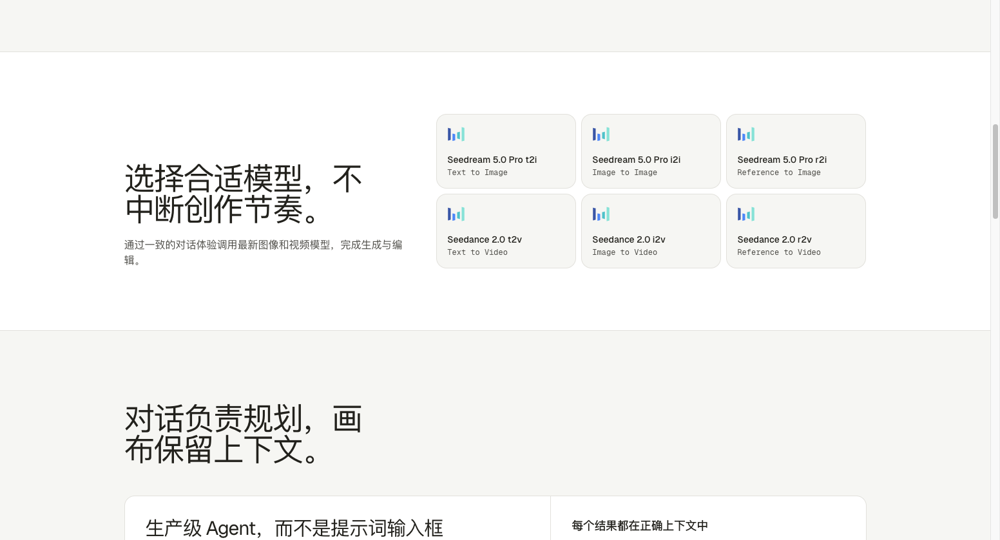
</p>
<p align="center">
  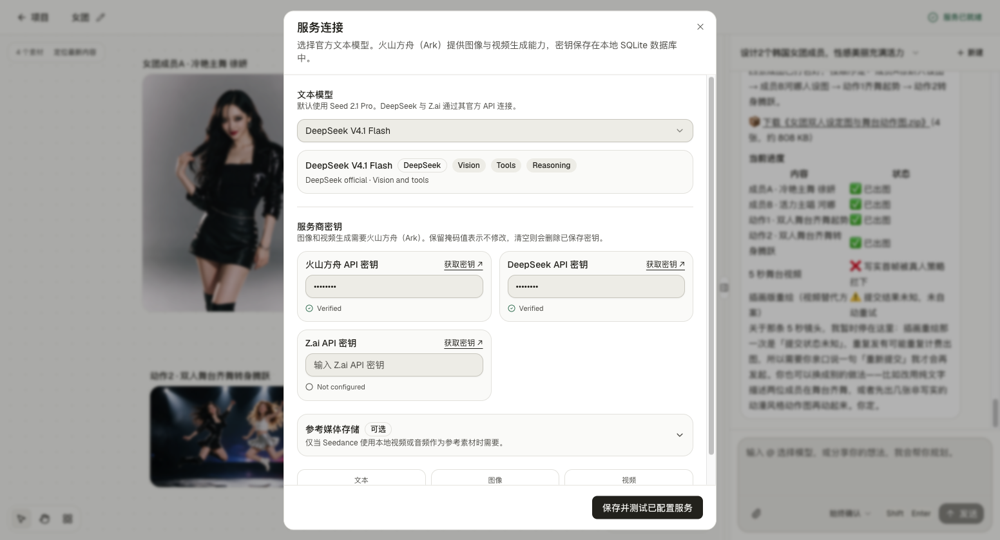
</p>

## Models

Type `@` in the agent composer to pin a model. Image and video generation can use [Volcengine Ark](https://console.volcengine.com/ark) or Agnes independently. Catalogs live in `shared/constants/modelCatalog.ts` and `shared/constants/aiModels.ts`.

| Role | Model | Provider |
| --- | --- | --- |
| Agent text (default) | Seed 2.1 Pro | Volcengine Ark · Doubao |
| Agent text | Seed 2.1 Turbo | Volcengine Ark · Doubao |
| Agent text | DeepSeek V4.1 Flash | DeepSeek official |
| Agent text | GLM 5.3 | Z.ai official |
| Agent text | Agnes 2.5 Flash | Agnes official |
| Agent text | Agnes 3.0 Flash | Agnes official |
| Image · t2i / i2i / r2i | Seedream 5.0 Pro | Volcengine Ark |
| Image · t2i / i2i / r2i | Agnes Image 2.5 Flash | Agnes official |
| Video · t2v / i2v / r2v | Seedance 2.0 | Volcengine Ark |
| Video · t2v / i2v / r2v | Agnes Video 2.5 Flash | Agnes official |

Models are still being added. Open an [issue](https://github.com/susirial/Miao-AI/issues) if you need a specific mainland-China endpoint.

## Quick start

You need **Node.js 22.20+** and **pnpm**.

```sh
git clone https://github.com/susirial/Miao-AI.git
cd Miao-AI
pnpm i
pnpm dev
```

Open [http://localhost:3001](http://localhost:3001). Keep the terminal running. You do not need `pnpm build` for everyday local use.

### macOS desktop

```sh
pnpm desktop:dev          # Nuxt HMR + Electron window
pnpm desktop:dir          # unpacked Miao.app for local checks
pnpm desktop:build        # DMG + ZIP under release/
```

Desktop data lives in `~/Library/Application Support/Miao/data`. Logs are in `~/Library/Logs/Miao`. Unsigned local builds work on your Mac; distributing to other machines needs a Developer ID certificate. Set `APPLE_ID`, `APPLE_APP_SPECIFIC_PASSWORD`, and `APPLE_TEAM_ID` to notarize.

Linux and Windows can run the **web** app today. Packaged desktop builds are macOS-only for now.

### FFmpeg (long-form video only)

Uploads and single-shot generation do not need FFmpeg. Concatenating clips into a longer video does.

```sh
# macOS
brew install ffmpeg

# Ubuntu / Debian
sudo apt update && sudo apt install ffmpeg
```

Confirm both `ffmpeg` and `ffprobe` are on `PATH`, then restart the app.

## Connect providers

1. Start Miao and open **Service connection** in the top-right corner.
2. Enter a [Volcengine Ark API key](https://console.volcengine.com/ark/region:ark+cn-beijing/apiKey). Ark powers Seed text, Seedream, and Seedance.
3. Optionally add [DeepSeek](https://platform.deepseek.com/api_keys), [Z.ai](https://z.ai/manage-apikey/apikey-list), or [Agnes](https://platform.agnes-ai.com/) keys. One Agnes key unlocks Agnes text, image, and video models.
4. Click **Save and test configured providers**.

The default agent model is **Seed 2.1 Pro** (`ark/seed-2.1-pro`). Connection tests send a short request and may incur a small API charge. Keys are stored in local SQLite, not in `.env`.

[Agnes 2.5 Flash](https://wiki.agnes-ai.com/en/docs/agnes-25-flash.md) and [Agnes 3.0 Flash](https://agnes-ai.com/zh-Hans/docs/agnes-30-flash) text models accept public HTTP(S) image URLs only in Miao. This text-model Vision restriction does not apply to Agnes Image generation, where local JPEG, PNG, and WEBP inputs are converted to Data URI.

Agnes Video 2.5 Flash generates at 720P for 4–12 seconds. Image-to-video and reference-to-video accept public HTTPS image or audio URLs only; local uploads, reference videos, and explicit audio-track control are not supported. Agnes availability and rate limits depend on your account tier; see the official documentation for current limits.

### Optional TOS for Seedance local references

Text-to-video and image-to-video do not need TOS. Only local video/audio used as a Seedance reference must be uploaded to a `cn-beijing` bucket. Region and endpoint are fixed to `https://tos-cn-beijing.volces.com`. Miao uploads content-addressed objects and issues short-lived GET URLs; it does not delete those objects when a task is removed.

## Architecture

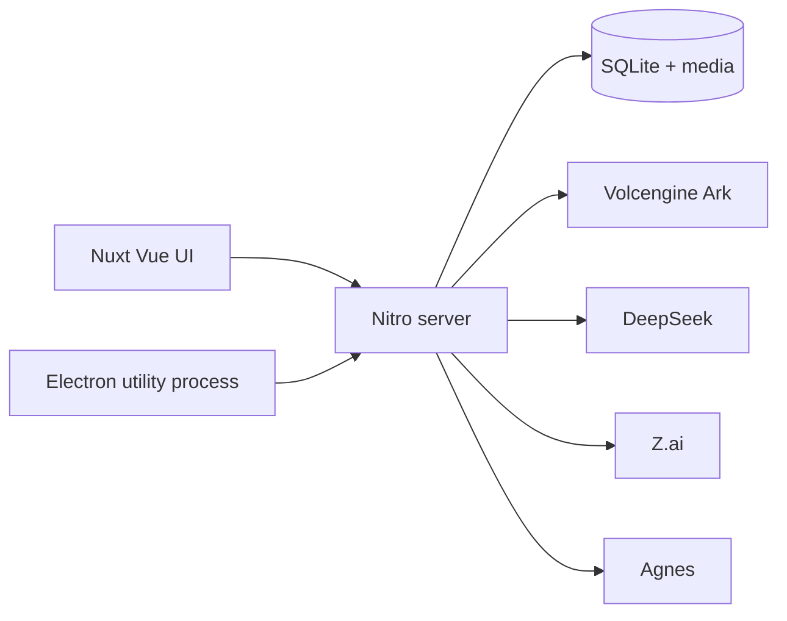

- `app/` — Vue pages, canvas, agent chat
- `server/` — APIs, in-process agent loop, Ark / DeepSeek / Z.ai / Agnes adapters
- `shared/` — model catalogs and types
- `electron/` — macOS shell: isolated Nitro on a random loopback port, per-launch token, no Node in the renderer

There is no hosted demo. The workspace routes are unauthenticated by design — run the web server only on your machine or a private network.

## Creative workflows

Ask the agent to edit an image or video, or to produce a multi-shot piece. Public skills:

| Skill | Command | What you do |
| --- | --- | --- |
| Annotated image edit | `/image-annotation-edit` | Pin locations and describe each change |
| Sketch to image | `/sketch-to-image` | Draw a composition, then confirm |
| Marketing graphics | `/app-store-graphics` | Supply screenshots, confirm a design board |
| Long-form video | `/long-form-video` | Plan shots, generate clips, stitch |

A typical long-form video pass:

1. Plan the storyboard from your brief.
2. Establish character references (or upload your own).
3. Generate first frames for each shot.
4. Turn shots into clips with Seedance.
5. Stitch clips with FFmpeg, then keep revising in the same conversation.

The skill file is [`server/agent/skills/long-form-video.md`](server/agent/skills/long-form-video.md).

## Local data

| Launch | Database and media |
| --- | --- |
| Web | `.data/miao.sqlite` and `.data/media` |
| Desktop | `~/Library/Application Support/Miao/data` |
| Override | `MIAO_DATA_DIR` |

Existing `.data/polox.sqlite` is copied on first launch after an upgrade. Stop the server before backing up `.data`. Treat backups as secret — they contain API keys.

See [`.env.example`](.env.example) for optional process environment. Do not put provider keys there.

## Contributing

See [CONTRIBUTING.md](CONTRIBUTING.md) / [简体中文](CONTRIBUTING.zh-CN.md). Please read [SECURITY.md](SECURITY.md) before filing anything that involves keys or local data.

```sh
pnpm lint
pnpm typecheck
pnpm test:llm
pnpm test:sqlite
pnpm test:electron-main
```

## Open-source foundations

| Role | Project |
| --- | --- |
| Application | [Nuxt](https://github.com/nuxt/nuxt) |
| UI | [shadcn/ui](https://github.com/shadcn-ui/ui) Vue ecosystem |
| UI template | [nuxt-shadcn-dashboard](https://github.com/dianprata/nuxt-shadcn-dashboard) |
| Agent harness | [DeepSeek Harness](https://github.com/deepseek-ai/deepseek-harness) |

## License

[MIT](LICENSE). Third-party notices are listed in [NOTICE](NOTICE).
