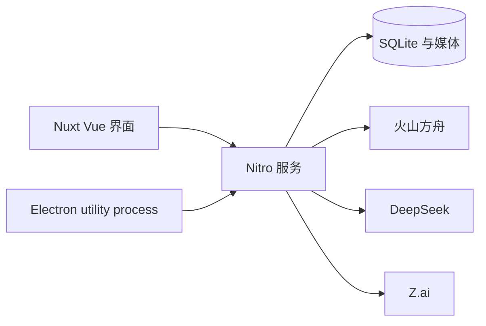

<p align="center">
  
</p>

<h1 align="center">妙 AI</h1>

<p align="center">
  面向中国大模型的多模态 AI Agent。<br>
  用 GLM、DeepSeek、豆包、Seedream、Seedance 对话、生成、编辑 —— 全部落在无限画布上。
</p>

<p align="center">
  <a href="LICENSE"></a>
  <a href="https://github.com/susirial/Miao-AI/actions/workflows/ci.yml"></a>
  
  
  <a href="https://github.com/susirial/Miao-AI/stargazers"></a>
</p>

<p align="center">
  <a href="README.md">English</a> · <strong>简体中文</strong>
</p>

<p align="center">
  
</p>

Miao 是本地优先的 **Agent 原生**创作工作区：交互发生在对话里，结果落在无限画布上。它是 [PoloX AI](https://github.com/saihhold-zhao/polox_ai) 的中国大模型特化分支，推理走国内官方 API，而不是 WaveSpeed。

使用你自己的密钥。无需 Miao 账号或云端工作区。项目、对话、生成记录和媒体都保存在本机。

## 为什么用 Miao

- **Agent + 画布，而不是提示词输入框。** 规划需求、确认模型、生成图片或视频，在同一条对话里持续迭代。
- **中国大模型。** GLM 5.3、DeepSeek、豆包 Seed 文本、Seedream 5.0 Pro、Seedance 2.0。更多服务商仍在接入。
- **Web 与 macOS 桌面。** 同一套 Nuxt 应用；Electron 只监听 `127.0.0.1`。
- **本地 SQLite。** 密钥只在你配置的服务商请求中离开本机。

## 截图

<p align="center">
  
</p>
<p align="center">
  
</p>
<p align="center">
  
</p>
<p align="center">
  
</p>

## 已接入模型

在 Agent 输入框输入 `@` 可指定模型。图像与视频生成走 [火山方舟](https://console.volcengine.com/ark)。目录见 `shared/constants/modelCatalog.ts` 与 `shared/constants/aiModels.ts`。

| 用途 | 模型 | 服务商 |
| --- | --- | --- |
| Agent 文本（默认） | Seed 2.1 Pro | 火山方舟 · 豆包 |
| Agent 文本 | Seed 2.1 Turbo | 火山方舟 · 豆包 |
| Agent 文本 | DeepSeek V4.1 Flash | DeepSeek 官方 |
| Agent 文本 | GLM 5.3 | Z.ai 官方 |
| 图像 · t2i / i2i / r2i | Seedream 5.0 Pro | 火山方舟 |
| 视频 · t2v / i2v / r2v | Seedance 2.0 | 火山方舟 |

模型仍在持续添加。若需要某个国内端点，请开 [Issue](https://github.com/susirial/Miao-AI/issues)。

## 快速开始

需要 **Node.js 22.20+** 和 **pnpm**。

```sh
git clone https://github.com/susirial/Miao-AI.git
cd Miao-AI
pnpm i
pnpm dev
```

打开 [http://localhost:3001](http://localhost:3001)，保持终端运行。日常使用不必执行 `pnpm build`。

### macOS 桌面端

```sh
pnpm desktop:dev          # Nuxt 热更新 + Electron 窗口
pnpm desktop:dir          # 未打包的 Miao.app，用于本机验证
pnpm desktop:build        # 在 release/ 下生成 DMG 和 ZIP
```

桌面数据位于 `~/Library/Application Support/Miao/data`，日志位于 `~/Library/Logs/Miao`。未签名构建可以在本机使用；分发到其他 Mac 需要 Developer ID 证书。同时设置 `APPLE_ID`、`APPLE_APP_SPECIFIC_PASSWORD`、`APPLE_TEAM_ID` 后会自动公证。

Linux 与 Windows 目前可运行 **Web**。安装包仅提供 macOS。

### FFmpeg（仅长视频拼接）

普通上传和单次生成不需要 FFmpeg。把多个片段拼成更长视频时需要。

```sh
# macOS
brew install ffmpeg

# Ubuntu / Debian
sudo apt update && sudo apt install ffmpeg
```

确认 `ffmpeg` 与 `ffprobe` 都在 `PATH` 中，然后重启应用。

## 配置服务商

1. 启动 Miao，点击右上角 **服务连接**。
2. 填写 [火山方舟 API Key](https://console.volcengine.com/ark/region:ark+cn-beijing/apiKey)。方舟提供 Seed 文本、Seedream 图像和 Seedance 视频。
3. 可选填写 [DeepSeek](https://platform.deepseek.com/api_keys) 或 [Z.ai](https://z.ai/manage-apikey/apikey-list) 密钥，并选择对应文本模型。
4. 点击 **保存并测试已配置服务**。

默认 Agent 模型为 **Seed 2.1 Pro**（`ark/seed-2.1-pro`）。连通测试会发送一次短请求，可能产生少量费用。密钥存在本地 SQLite，不要写进 `.env`。

### 可选 TOS：Seedance 本地参考素材

文生视频和图生视频不需要 TOS。仅当把本机视频/音频作为 Seedance 参考时，才需要 `cn-beijing` 的 Bucket。Region 与 endpoint 固定为 `https://tos-cn-beijing.volces.com`。Miao 按内容哈希上传对象并签发短期 GET URL；删除任务时不会删除 TOS 对象。

## 架构



- `app/` — Vue 页面、画布、Agent 对话
- `server/` — API、进程内 Agent 循环、方舟 / DeepSeek / Z.ai 适配
- `shared/` — 模型目录与类型
- `electron/` — macOS 壳：隔离 Nitro、随机回环端口、每次启动独立令牌，渲染进程无 Node

没有在线 Demo。工作区接口默认不鉴权 —— 请只在本机或私有网络运行 Web 服务。

## 与 PoloX AI 的差异

| | 妙 AI | PoloX AI |
| --- | --- | --- |
| 推理 | 火山方舟、DeepSeek、Z.ai | WaveSpeed |
| 图像 / 视频 | Seedream 5 · Seedance 2 | WaveSpeed 目录 |
| 桌面 | macOS Electron | Web |
| 数据 | 本地 SQLite | 本地 SQLite |

Miao 保留 PoloX 的 Agent 画布工作流和 [DeepSeek Harness](https://github.com/deepseek-ai/deepseek-harness) 基础。属于 PoloX 本身的改动请提到 [上游仓库](https://github.com/saihhold-zhao/polox_ai)。

## 创作流程

可以让 Agent 编辑图片或视频，或制作多分镜成片。长视频的典型路径：

1. 根据需求规划分镜。
2. 确定角色参考（也可上传自己的形象）。
3. 为每个镜头生成首帧。
4. 用 Seedance 把镜头做成片段。
5. 用 FFmpeg 拼接，并在同一对话里继续修改。

Skill 文件见 [`server/agent/skills/long-form-video.md`](server/agent/skills/long-form-video.md)。

## 本地数据

| 启动方式 | 数据库与媒体 |
| --- | --- |
| Web | `.data/miao.sqlite` 与 `.data/media` |
| 桌面 | `~/Library/Application Support/Miao/data` |
| 覆盖 | `MIAO_DATA_DIR` |

升级后首次启动会复制已有的 `.data/polox.sqlite`。请先停止服务再备份 `.data`。备份里含 API Key，请当作机密保管。

可选进程环境变量见 [`.env.example`](.env.example)。不要把服务商密钥写进去。

## 参与贡献

见 [CONTRIBUTING.zh-CN.md](CONTRIBUTING.zh-CN.md) / [English](CONTRIBUTING.md)。涉及密钥或本地数据的问题请先读 [SECURITY.md](SECURITY.md)。

```sh
pnpm lint
pnpm typecheck
pnpm test:sqlite
pnpm test:electron-main
```

## 使用到的开源项目

| 用途 | 项目 |
| --- | --- |
| 应用框架 | [Nuxt](https://github.com/nuxt/nuxt) |
| UI | [shadcn/ui](https://github.com/shadcn-ui/ui) Vue 生态 |
| UI 模板 | [nuxt-shadcn-dashboard](https://github.com/dianprata/nuxt-shadcn-dashboard) |
| Agent Harness | [DeepSeek Harness](https://github.com/deepseek-ai/deepseek-harness) |
| 上游产品 | [PoloX AI](https://github.com/saihhold-zhao/polox_ai) |

## 开源协议

[MIT](LICENSE)。第三方声明见 [NOTICE](NOTICE)。
