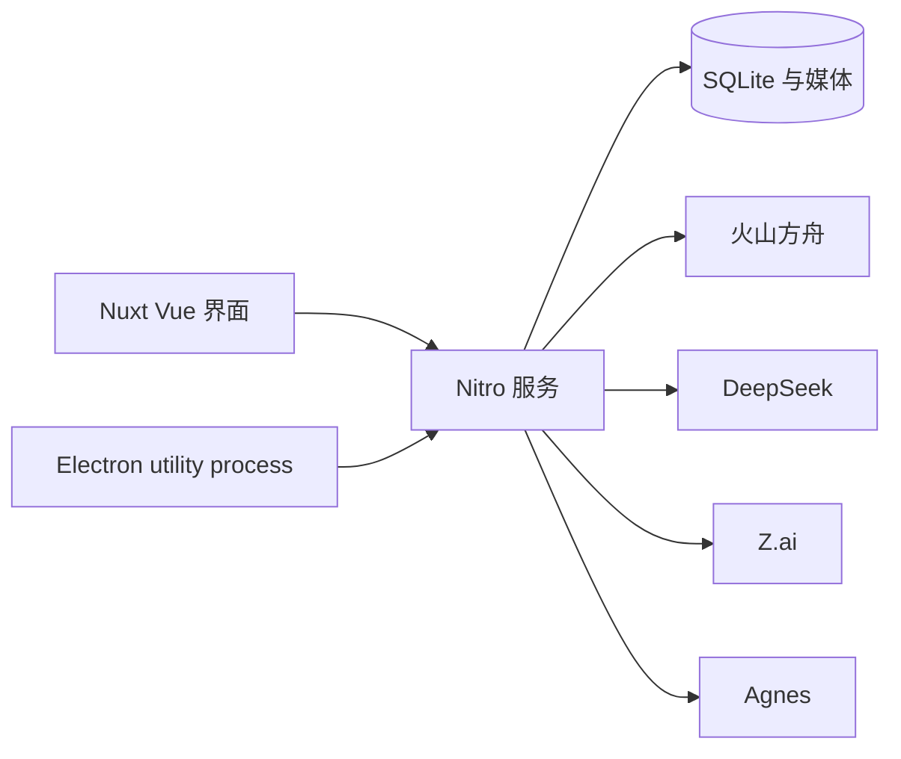

<p align="center">
  
</p>

<h1 align="center">喵 AI</h1>

<p align="center">
  <strong>M</strong> 大模型 · <strong>I</strong> 智能 · <strong>A</strong> 创作助手 · <strong>O</strong> 开放<br>
  面向中国大模型的开放创作助手。用对话调用文本、图像与视频，结果落在无限画布上。
</p>

<p align="center">
  <a href="LICENSE"></a>
  <a href="https://github.com/susirial/Miao-AI/actions/workflows/ci.yml"></a>
  
  
  <a href="https://github.com/susirial/Miao-AI/stargazers"></a>
</p>

<p align="center">
  <a href="README.md">English</a> · <strong>简体中文</strong>
</p>

<p align="center">
  
</p>

**喵 AI**（Miao）是本地优先的创作助手：你和 Agent 对话，每一张图、每一段视频都落在无限画布上。本项目由 [PoloX AI](https://github.com/saihhold-zhao/polox_ai) 魔改而来。

使用你自己的密钥。无需注册喵 AI 账号或云端工作区。项目、对话、生成记录和媒体都保存在本机。

## MIAO 四个字母

| | 含义 | 在产品里 |
| --- | --- | --- |
| **M** | 大模型 | 文本、生图、视频等模型：Agnes、GLM、DeepSeek、豆包、Seedream、Seedance，并持续接入 |
| **I** | 智能 | Agent 会规划、确认关键选择，并执行多步制作 |
| **A** | 创作助手 | 对话 + 无限画布，而不是一个提示词输入框 |
| **O** | 开放 | MIT 开源、本地运行、自带 Key |

## 为什么用喵 AI

- **大模型在同一条对话里。** 用 `@` 指定 Agnes 2.5 Flash、GLM 5.3、DeepSeek、豆包 Seed、Seedream 5 或 Seedance 2，不必跳出工作流。
- **智能会把事情做完。** Agent 把一句话变成分镜、静帧或视频，并继续和你一起改。
- **创作助手，不是聊天窗口。** 每个结果留在画布上，方便比较、复用和导出。
- **开放，且在你的机器上。** Web 与 macOS 桌面；数据在本地 SQLite；没有喵 AI 云。

## 更新记录

### 2026-09-19 — Agnes 模型与生图 / 生视频选择

服务连接现可分别选择文本、生图、生视频模型。首页卡片会打开对应 Generator 模型；用 `@` 或深链指定的模型不会被已保存的媒体族偏好覆盖。一个 [Agnes](https://platform.agnes-ai.com/) 密钥同时解锁文本、生图和生视频。

- **文本：** [Agnes 2.5 Flash](https://wiki.agnes-ai.com/en/docs/agnes-25-flash.md)、[Agnes 3.0 Flash](https://agnes-ai.com/zh-Hans/docs/agnes-30-flash)。对话 Vision 只接受公开可访问的 HTTP(S) 图片 URL。
- **生图：** Agnes Image 2.5 Flash，可与 Seedream 5.0 Pro 并列选择。支持文生图、图生图、参考生图；可指定 1K–4K 档位与比例。本地 JPEG / PNG / WEBP 会转成 Data URI，不必先传到公网。
- **生视频：** Agnes Video 2.5 Flash，可与 Seedance 2.0 并列选择。固定 720P、4–12 秒。图生视频 / 参考生视频只用公网 HTTPS 图片或音频 URL（参考图最多 5 张），不支持本地上传或参考视频。

Agent 出图或出片前会弹出确认卡，核对模型、提示词和参数后再生成。标注修图不再把 TOS 重映射后的静图当 vision URL 发给模型；Agnes Image 会把可达的 HTTP(S) 静图内联为 data URI。

未配置密钥时，「保存并测试」会提示先填写密钥，而不再像按钮没点上。模型请求失败会记录 host 和错误原因链，日志里不写 API key。

#### 文生图 · Agnes Image 2.5 Flash

用自然语言描述画面。确认卡会列出所选模型和提示词，例如下面这张「迈达克·乔丹空中标志性单手持球」的文生图任务。

<p align="center">
  
</p>

#### 多图参考生视频 · Agnes Video 2.5 Flash

把多张公开 HTTPS 参考图交给参考生视频。确认卡会展示 720P、时长、画幅和参考图列表，例如下面用两张乔丹照片做 5 秒 16:9 参考生视频。

<p align="center">
  
</p>

### 2026-09-16 — 引导式创作 Skill

项目页可以直接开始三条制作工作流。点击对应 Skill（或在 Agent 输入框输入 `/`），就会在当前项目里和你一起确认每一步。

#### 标注修图 · `/image-annotation-edit`

在原图上放置编号点，逐点写下要改什么，其余区域尽量保持不动。编辑器里用不同颜色区分各个点位。

<p align="center">
  
  
</p>
<p align="center">
  
</p>

#### 草图生图 · `/sketch-to-image`

在对话里的画板上画一个粗略构图。确认 Agent 对草图的理解后，由 Seedream 生成完整成图。

<p align="center">
  
  
</p>

#### 营销图 · `/app-store-graphics`

准备真实产品图或应用截图。Agent 先给出 9:16 设计方案（配色、字体、手机框）供你确认，再输出风格统一的营销图。

<p align="center">
  
  
  
</p>

长视频创作（`/long-form-video`）仍可用于多分镜成片。

## 截图

<p align="center">
  
</p>
<p align="center">
  
</p>
<p align="center">
  
</p>
<p align="center">
  
</p>

## 已接入模型

在 Agent 输入框输入 `@` 可指定模型。图像与视频生成可分别使用 [火山方舟](https://console.volcengine.com/ark) 或 Agnes。目录见 `shared/constants/modelCatalog.ts` 与 `shared/constants/aiModels.ts`。

| 用途 | 模型 | 服务商 |
| --- | --- | --- |
| Agent 文本（默认） | Seed 2.1 Pro | 火山方舟 · 豆包 |
| Agent 文本 | Seed 2.1 Turbo | 火山方舟 · 豆包 |
| Agent 文本 | DeepSeek V4.1 Flash | DeepSeek 官方 |
| Agent 文本 | GLM 5.3 | Z.ai 官方 |
| Agent 文本 | Agnes 2.5 Flash | Agnes 官方国际站 API |
| Agent 文本 | Agnes 3.0 Flash | Agnes 官方国际站 API |
| 图像 · t2i / i2i / r2i | Seedream 5.0 Pro | 火山方舟 |
| 图像 · t2i / i2i / r2i | Agnes Image 2.5 Flash | Agnes 官方 |
| 视频 · t2v / i2v / r2v | Seedance 2.0 | 火山方舟 |
| 视频 · t2v / i2v / r2v | Agnes Video 2.5 Flash | Agnes 官方 |

模型仍在持续添加。若需要某个国内端点，请开 [Issue](https://github.com/susirial/Miao-AI/issues)。

## 快速开始

需要 **Node.js 22.20+** 和 **pnpm**。

```sh
git clone https://github.com/susirial/Miao-AI.git
cd Miao-AI
pnpm i
pnpm dev
```

打开 [http://localhost:3001](http://localhost:3001)，保持终端运行。日常使用不必执行 `pnpm build`。

### macOS 桌面端

```sh
pnpm desktop:dev          # Nuxt 热更新 + Electron 窗口
pnpm desktop:dir          # 未打包的 Miao.app，用于本机验证
pnpm desktop:build        # 在 release/ 下生成 DMG 和 ZIP
```

桌面数据位于 `~/Library/Application Support/Miao/data`，日志位于 `~/Library/Logs/Miao`。未签名构建可以在本机使用；分发到其他 Mac 需要 Developer ID 证书。同时设置 `APPLE_ID`、`APPLE_APP_SPECIFIC_PASSWORD`、`APPLE_TEAM_ID` 后会自动公证。

Linux 与 Windows 目前可运行 **Web**。安装包仅提供 macOS。

### FFmpeg（仅长视频拼接）

普通上传和单次生成不需要 FFmpeg。把多个片段拼成更长视频时需要。

```sh
# macOS
brew install ffmpeg

# Ubuntu / Debian
sudo apt update && sudo apt install ffmpeg
```

确认 `ffmpeg` 与 `ffprobe` 都在 `PATH` 中，然后重启应用。

## 配置服务商

1. 启动喵 AI，点击右上角 **服务连接**。
2. 填写 [火山方舟 API Key](https://console.volcengine.com/ark/region:ark+cn-beijing/apiKey)。方舟提供 Seed 文本、Seedream 图像和 Seedance 视频。
3. 可选填写 [DeepSeek](https://platform.deepseek.com/api_keys)、[Z.ai](https://z.ai/manage-apikey/apikey-list) 或 [Agnes](https://platform.agnes-ai.com/) 密钥。一个 Agnes 密钥可同时解锁 Agnes 文本、图像和视频模型。
4. 点击 **保存并测试已配置服务**。

默认 Agent 模型为 **Seed 2.1 Pro**（`ark/seed-2.1-pro`）。连通测试会发送一次短请求，可能产生少量费用。密钥存在本地 SQLite，不要写进 `.env`。

[Agnes 2.5 Flash](https://wiki.agnes-ai.com/en/docs/agnes-25-flash.md) 与 [Agnes 3.0 Flash](https://agnes-ai.com/zh-Hans/docs/agnes-30-flash) 文本模型在喵 AI 中仅接受公开可访问的 HTTP(S) 图片 URL。该文本 Vision 限制不适用于 Agnes Image 生图，本地 JPEG、PNG、WEBP 素材会转换为 Data URI。

Agnes Video 2.5 Flash 固定生成 720P、4–12 秒视频。图生视频和参考生视频仅接受公网 HTTPS 图片或音频 URL；不支持本地上传、参考视频或显式音轨控制。Agnes 的可用性与速率限制取决于账户等级，请以官方文档为准。

### 可选 TOS：Seedance 本地参考素材

文生视频和图生视频不需要 TOS。仅当把本机视频/音频作为 Seedance 参考时，才需要 `cn-beijing` 的 Bucket。Region 与 endpoint 固定为 `https://tos-cn-beijing.volces.com`。喵 AI 按内容哈希上传对象并签发短期 GET URL；删除任务时不会删除 TOS 对象。

## 架构



- `app/` — Vue 页面、画布、Agent 对话
- `server/` — API、进程内 Agent 循环、方舟 / DeepSeek / Z.ai / Agnes 适配
- `shared/` — 模型目录与类型
- `electron/` — macOS 壳：隔离 Nitro、随机回环端口、每次启动独立令牌，渲染进程无 Node

没有在线 Demo。工作区接口默认不鉴权 —— 请只在本机或私有网络运行 Web 服务。

## 创作流程

可以让 Agent 编辑图片或视频，或制作多分镜成片。当前公开 Skill：

| Skill | 命令 | 你要做的 |
| --- | --- | --- |
| 标注修图 | `/image-annotation-edit` | 打点并逐项说明修改 |
| 草图生图 | `/sketch-to-image` | 画构图，再确认理解 |
| 营销图 | `/app-store-graphics` | 提供截图，确认设计方案 |
| 长视频创作 | `/long-form-video` | 规划分镜、出片、拼接 |

长视频的典型路径：

1. 根据需求规划分镜。
2. 确定角色参考（也可上传自己的形象）。
3. 为每个镜头生成首帧。
4. 用 Seedance 把镜头做成片段。
5. 用 FFmpeg 拼接，并在同一对话里继续修改。

Skill 文件见 [`server/agent/skills/long-form-video.md`](server/agent/skills/long-form-video.md)。

## 本地数据

| 启动方式 | 数据库与媒体 |
| --- | --- |
| Web | `.data/miao.sqlite` 与 `.data/media` |
| 桌面 | `~/Library/Application Support/Miao/data` |
| 覆盖 | `MIAO_DATA_DIR` |

升级后首次启动会复制已有的 `.data/polox.sqlite`。请先停止服务再备份 `.data`。备份里含 API Key，请当作机密保管。

可选进程环境变量见 [`.env.example`](.env.example)。不要把服务商密钥写进去。

## 参与贡献

见 [CONTRIBUTING.zh-CN.md](CONTRIBUTING.zh-CN.md) / [English](CONTRIBUTING.md)。涉及密钥或本地数据的问题请先读 [SECURITY.md](SECURITY.md)。

```sh
pnpm lint
pnpm typecheck
pnpm test:llm
pnpm test:sqlite
pnpm test:electron-main
```

## 使用到的开源项目

| 用途 | 项目 |
| --- | --- |
| 应用框架 | [Nuxt](https://github.com/nuxt/nuxt) |
| UI | [shadcn/ui](https://github.com/shadcn-ui/ui) Vue 生态 |
| UI 模板 | [nuxt-shadcn-dashboard](https://github.com/dianprata/nuxt-shadcn-dashboard) |
| Agent Harness | [DeepSeek Harness](https://github.com/deepseek-ai/deepseek-harness) |

## 开源协议

[MIT](LICENSE)。第三方声明见 [NOTICE](NOTICE)。
